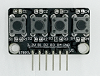

# tijos.framework.sensor/transducer - 传感器

TiJOS Framework支持如下传感器

| Java Class                               | 传感器模块名称                                  | 型号             |                    图片                    |
| ---------------------------------------- | ---------------------------------------- | -------------- | :--------------------------------------: |
| tijos.framework.sensor.button.TiButton   | [按键模块](tijos.framework.sensor.button.md) | 通用             |           |
| tijos.framework.transducer.led.TiLED     | [LED灯模块](tijos.framework.transducer.led.md) | 通用             |                 |
| tijos.framework.transducer.led.TiRGBLED  | [三基色灯模块](tijos.framework.transducer.led.md) | 通用             |           |
| tijos.framework.transducer.led.TiOLED_UG2864 | [OLED12864显示模块](tijos.framework.transducer.led.md) | UG2864         |  |
| tijos.framework.transducer.relay.TiRelay1CH | [单通道继电器模块](tijos.framework.transducer.relay.md) | 通用             |       |
| tijos.framework.sensor.gas.TiMQ2         | [可燃气体浓度检测模块](tijos.framework.sensor.gas.md) | MQ-2           |                 |
| tijos.framework.sensor.humiture.TiDHT    | [数字温湿度采集模块](tijos.framework.sensor.humiture.md) | DHT11          |             |
| tijos.framework.sensor.humiture.TiDS18B20 | [数字温度采集模块](tijos.framework.sensor.humiture.md) | DS18B20        |         |
| tijos.framework.transducer.buzzer.TiBuzzer | [有源蜂鸣器模块](tijos.framework.transducer.buzzer.md) | 通用             |           |
| tijos.framework.sensor.infrared.TiVS1838BNEC | [红外接收模块](tijos.framework.sensor.infrared.md) | VS1838B        |       |
| tijos.framework.sensor.distance.TiHSCR04 | [超声波测距模块](tijos.framework.sensor.distance.md) | HCSR04/HCSR04+ |           |
| tijos.framework.sensor.general.TiGeneralSensor | [通用传感器](tijos.framework.sensor.general.md) | 通用             |                 通用4线传感器                  |

更多传感器在不断丰富中。